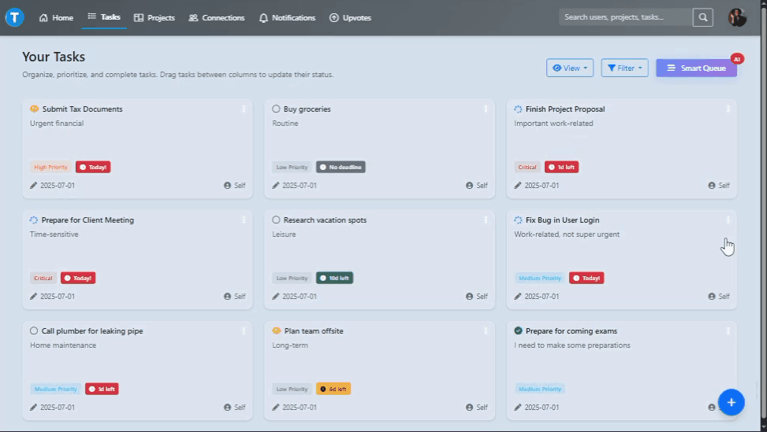
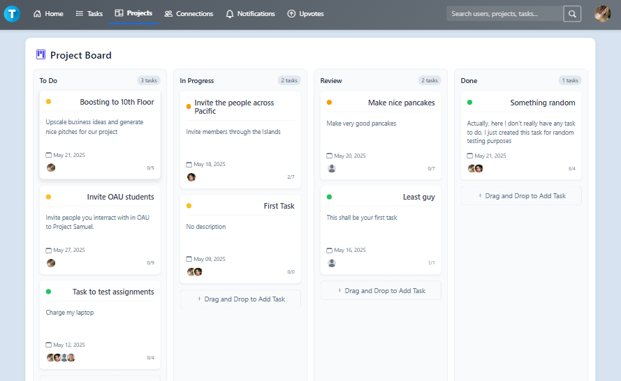

<div align="center">
  
  <h1 style="display: inline-block; vertical-align: middle; margin: 0;">TaskFlow</h1>
  <h2><i>The AI-Powered Productivity Platform That Adapts to You</i></h2>
</div>

<div align="center">  
    
</div>  

---

## ✨ **Why TaskFlow?**  
TaskFlow isn't just another task manager—it's your **AI-powered productivity companion**. Designed for individuals and teams who demand more than checklists, TaskFlow learns your workflow to:  

- **Prioritize intelligently** with Smart Queue (context-aware sorting)  
- **Predict deadlines** with time estimation
- **Break down complex tasks** in one click  
- **Collaborate seamlessly** with interactive Kanban boards  

👉 **[Try TaskFlow Live Now!](https://ny55wzfkbb.execute-api.us-east-1.amazonaws.com)** 👈  

---

## 🔥 **Key Features**  

### **For Individuals**  
| Feature | Description |  
|---------|-------------|  
| **🧠 Smart Queue** | AI sorts tasks by deadline, priority *and* your energy levels |  
| **📊 Task Intelligence** | Get time estimates, risk alerts, and productivity insights |  
| **🎯 Subtask Generation** | Break "Write report" into actionable steps automatically |  
| **📅 Personal Kanban** | Drag-and-drop tasks between "To-Do" → "In Progress" → "Review" → "Done" |  

### **For Teams**  
| Feature | Description |  
|---------|-------------|  
| **👥 Project Workspaces** | Assign tasks, set roles, and track progress collectively |
| **📅 Project Kanban** | Manage projects tasks through drag-and-drop UI |
| **💬 Realtime Discussions** | Comment on tasks without switching apps |  
| **📈 Team Analytics** | Spot bottlenecks with completion rate dashboards |  
| **🚀 Public/Private Projects** | Join open projects or keep work internal |  

---

## 🛠️ **Tech Stack**  

<div align="center">  
    
</div>  

- **Backend:** Flask, Python  
- **Frontend:** HTML5, CSS3, JavaScript, Bootstrap 5  
- **Database:** PostgreSQL
- **Infrastructure:** Docker, AWS (EC2, S3), Cloudflare DNS  
- **CI/CD:** GitHub Actions for automated deployments  

---

## 🎨 **Sneak Peek**  

### **AI-Powered Smart Queue**  
  

### **Realtime Kanban Board**  

---

## 🚀 **Get Started in 30 Seconds**

### Prerequisites

- Python 3.x
- PostgreSQL
- Virtual environment (recommended)

### Installation

1. **Clone the repository:**

   ```bash
   git clone https://github.com/Sam-3l/TaskFlow.git
   cd TaskFlow
2. **Set up a virtual environment:**
   ```bash
   python -m venv venv
   source venv/bin/activate  # On Windows use `venv\Scripts\activate`
3. **Install dependencies:**
   ```bash
   pip install -r requirements.txt
4. **Configure the database:**
   Create a PostgreSQL database and update the database URL in the configuration file.
5. **Run migrations:**
   ```bash
   flask db upgrade
6. **Start the application:**
   ```bash
   flask run

### Usage

- Open your browser and navigate to `http://127.0.0.1:5000/`.
- Create and manage tasks, set deadlines, and use the tools provided to enhance productivity.

### Contributing

Feel free to submit issues, fork the repository, and create pull requests. Contributions are welcome!

---

<div align="center">  
  <h3>💡 Loved TaskFlow? Star the repo to support development!</h3>  
  <a href="https://github.com/Sam-3l/TaskFlow">  
      
  </a>  
</div>  

---

### **Join Productive Teams**  
[](https://ny55wzfkbb.execute-api.us-east-1.amazonaws.com)  

---

<sub>✨ Pro Tip: The more you use TaskFlow, the smarter its AI becomes!</sub>  
